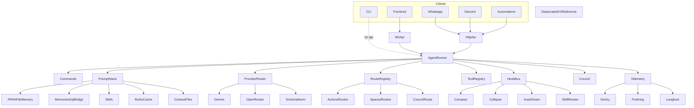

## Documentation / cleanup checklist

- `**ai/src/ai/deprecated/**` — Read-only v2 reference copy (Phase 9). When v3 reaches feature parity with v2 and **Phase 8 evals are all green on staging for ≥1 week**, delete the entire `ai/src/ai/deprecated/` tree in a single PR and remove this bullet.

---

- **Remove `ai/src/ai/deprecated/`** once v3 reaches feature parity and Phase-8-style evals stay green on staging for ≥1 week (single PR).
- dexter uses a cron, but we already have an alerts api .. hmm.. should we add whatsapp support? [https://hermes-agent.nousresearch.com/docs/user-guide/features/cron](https://hermes-agent.nousresearch.com/docs/user-guide/features/cron) [https://hermes-agent.nousresearch.com/docs/user-guide/messaging/discord](https://hermes-agent.nousresearch.com/docs/user-guide/messaging/discord)

temporary decay ... see [https://github.com/virattt/dexter/blob/main/src/memory/temporal-decay.ts](https://github.com/virattt/dexter/blob/main/src/memory/temporal-decay.ts)

- backend - see [https://cursor.com/docs/rules](https://cursor.com/docs/rules) to intelligent apply (need to add to agent_v2 also for manual + what about conditions)
 "spaces-discover", "spaces-knowledge-base-sources-refresh", "spaces-summary", "spaces-compact", "spaces-youtube-summary", 
- discord

Cron - A cron tool we should skeleton this ONLY.. create a empty folder with a todo
[https://github.com/NousResearch/hermes-agent/blob/main/tools/cronjob_tools.py](https://github.com/NousResearch/hermes-agent/blob/main/tools/cronjob_tools.py)

It should work like the hermes cron scheduler, you can copy a lot of the behaviour and functionality from:

[https://gemini.google.com/share/ad0d50aa0c18](https://gemini.google.com/share/ad0d50aa0c18)
[https://github.com/NousResearch/hermes-agent/tree/main/cron](https://github.com/NousResearch/hermes-agent/tree/main/cron)
[https://github.com/NousResearch/hermes-agent/blob/main/cron/jobs.py](https://github.com/NousResearch/hermes-agent/blob/main/cron/jobs.py)
[https://github.com/NousResearch/hermes-agent/blob/main/cron/scheduler.py](https://github.com/NousResearch/hermes-agent/blob/main/cron/scheduler.py)

Review this repo, any skills i should steal or architecture changes or stuff that is nice

[https://github.com/NateBJones-Projects/OB1](https://github.com/NateBJones-Projects/OB1)

add back the rules

#- Before you do any work, MUST view files in .claude/tasks/context_session_x.md file to get the full context (x being the id of the session we are operate, if file doesnt exist, then create one)
#- context_session_x.md should contain most of context of what we did, overall plan, and sub agents will continously add context to the file
#- After you finish the work, MUST update the .claude/tasks/context_session_x.md file to make sure others can get full context of what you did

---
name: remaining work
status: planned
created: 2026-04-26
---

# Remaining Work

Items not covered by Phases 0–22 (all completed). Three categories: **stub gaps** (scaffolds promised but not written), **planned extensions** (gated on external deps or product decision), and **maintenance** (cleanup after parity).

---

## 1. Discord Gateway — Full Implementation

**Priority:** Low (product-dependent)  
**Effort:** Medium  
**Blocked by:** `discord.py` optional dep + product decision on bot token management

Phase 17 shipped a `DiscordBot` stub that raises `NotImplementedError`. Full implementation requires:

- Install `discord.py` optional extra (`ai[discord]` — already wired in `pyproject.toml`)
- `src/ai/gateway/discord/bot.py` — real `discord.Client` subclass; on `on_message` call `HarnessForwarder.forward()` and reply
- `DISCORD_BOT_TOKEN` + `DISCORD_GUILD_ID` env vars (already documented in `docs/gateway.md`)
- Rate limiting via existing `RateLimiter` with Discord user id as sender key
- `tests/test_gateway_discord.py` — mock `discord.Client`, verify message → forwarder → reply path

**Reference:** `docs/gateway.md` has env vars + security notes already.

---

## 2. Deprecated v2 Cleanup

**Priority:** Low (timing-gated)  
**Effort:** Small (single PR when ready)

FUTURE.md + `FUTURE.md` (repo root): _"Remove `ai/src/ai/deprecated/` once v3 reaches feature parity and Phase-8-style evals stay green on staging for ≥1 week."_

**Checklist (gate before merge):**
- [ ] All Phase 8 golden YAML T0 cases pass on staging with v3 runner
- [ ] Green on staging for ≥7 consecutive days
- [ ] `tests/test_deprecated_import_smoke.py` and `tests/test_deprecated_isolation.py` deleted
- [x] `scripts/copy_v2.py` removed
- [ ] `src/ai/deprecated/` tree removed in a single PR
- [ ] `pyproject.toml` optional dep `deprecated` removed if present

**Do not merge this before the gate conditions are met.**

---

## 3. OB1 Repo Architecture Review

**Priority:** Low (research)  
**Effort:** Small (read-only analysis)

FUTURE.md mentions: _"Review this repo, any skills I should steal or architecture changes or stuff that is nice: https://github.com/NateBJones-Projects/OB1"_

**Outcome:** A short `docs/ob1-review.md` noting:
- Skills or prompt patterns worth porting
- Architecture differences vs this harness
- Anything already superseded by current implementation

---

## 4. Temporal Decay — Dexter Pattern Review

**Priority:** Low (research → maybe enhancement)  
**Effort:** Small to medium

FUTURE.md: _"temporary decay ... see https://github.com/virattt/dexter/blob/main/src/memory/temporal-decay.ts"_

Phase 4 (`memory-decay-tick` route) implements half-life scoring and `expires` validity transitions. Dexter's TypeScript approach uses continuous exponential decay on a `relevance_score` field with a configurable `decay_rate`. Review whether:

- The current `update_decay_state` in `src/ai/memory/decay.py` covers the same cases
- Dexter's per-entity decay rate config is useful for this harness
- Any gap should become a follow-up issue or Phase 4 enhancement

**If a gap is found:** add a `decay_rate` field to `MemoryFact` and update `update_decay_state` to use it.

---

## 5. Gateway Hardening (WhatsApp + Shared Forwarder)

**Priority:** Medium (WhatsApp is shipped but rough; Discord covered in §1)
**Effort:** Medium (split into 3 PRs)
**Scope:** `src/ai/gateway/{http_forwarder,whatsapp/*,discord/*}.py`

Phase 17 shipped a working WhatsApp gateway and Discord stub, but operational
hardening, tests, and several correctness gaps remain. Audit done 2026-05-02
against `ai/src/ai/gateway/` and `ai/docs/gateway.md`.

### 5a. Showstopper / correctness

- **No CLI entry point.** `docs/gateway.md:56` documents
  `python -m ai.gateway.whatsapp.client`, but `whatsapp/client.py` has no
  `if __name__ == "__main__":` block and there is no `__main__.py`. The command
  imports the module and exits. Fix: add `__main__.py` (or a
  `[project.scripts]` entry like `ai-whatsapp = "ai.gateway.whatsapp.client:main"`).
- **No tests at all** for `gateway/`. Forwarder, `RateLimiter`,
  `build_request_body`, and the WhatsApp text/JID extractors are easy unit
  targets; Discord is already listed in §1.
- **Empty bearer token allowed.** `HarnessForwarder.__init__` accepts
  `bearer_token = ""`; the harness then 401s with no useful diagnostic. Fail
  fast at startup if `GATEWAY_JWT` is unset.
- **`build_request_body(user_id=...)` accepts `user_id` but never uses it.**
  Harmless (harness derives user from JWT `sub`) but the signature is
  misleading. Either drop the param or wire it into a header for tracing.

### 5b. Functionality gaps

- **No streaming / progress relay.** HTTP `/v3/agent/question` returns one
  final response, so `chain_of_thought`, `task_update`, and "typing" events are
  lost. WhatsApp will look frozen for multi-second runs because there is no
  `SendChatPresence("composing", ...)` heartbeat.
- **No reply chunking / formatting transform.** Replies are sent verbatim. The
  prompt-builder hint asks the LLM to keep replies ≤4096 chars, but nothing
  enforces it; Markdown→WhatsApp formatting (`*bold*`, `_italic_`, no `#`
  headings) isn't applied either.
- **Conversation grouping is too coarse.** `conversation_id = chat JID`, so
  one WhatsApp contact = one conversation forever — no per-topic split, no
  rotation. Agent history accumulates indefinitely under that single key.
- **Group chats answer everything.** `_is_own_message` is filtered, but DMs
  vs groups aren't distinguished and there's no `@mention` / wake-word gate.
  Adding the bot to a group makes it reply to every text message.
- **Non-text messages dropped silently.** Images, audio, voice notes,
  documents, buttons, locations, reactions, and quoted/replied messages are
  all skipped with a single `ignoring non-text message` debug log — no type
  breakdown.
- **No message dedupe / idempotency.** Neonize can redeliver after reconnect;
  nothing keys off `message_ev.Info.ID`, so the agent can rerun the same
  prompt.
- **No retries / status differentiation.** Any `httpx` error becomes a generic
  `_ERROR_REPLY`. No backoff, no 5xx-vs-4xx handling, no surfacing of
  `RateLimitError` raised on the harness side.
- **`asyncio.run()` per inbound message.** `WhatsAppMessageHandler.handle`
  spins up a fresh event loop and a fresh `httpx.AsyncClient` for every
  message — no connection pool reuse and inbound traffic serializes.
- **Rate limiter never garbage-collects.** `RateLimiter._log` is a
  `defaultdict(list)` that accumulates one entry per sender_id forever. Long
  uptimes leak memory across the unique-sender set; also no hard cap on
  `_log[sender_id]` length.

### 5c. Coding-standard violations vs `AGENTS.md`

- **Config not via `shared.envutil.config` / `ai.config`.** Every env var
  (`HARNESS_URL`, `GATEWAY_JWT`, `GATEWAY_TIMEOUT_S`, `GATEWAY_RATE_LIMIT_*`,
  `GATEWAY_MAX_TEXT_LEN`, `WHATSAPP_*`) is read with raw `os.getenv` at module
  import time (`http_forwarder.py:65-68`, `handlers.py:30`, `client.py:64-66`).
  The "Configuration via shared.envutil.config" rule says these should live in
  a registered dataclass.
- **Broad `except Exception`** in `_extract_text`, `_sender_jid`,
  `_conversation_id`, `_is_own_message`, the final handler, `_send_reply`, and
  `WhatsAppClient.disconnect`. Violates the "Be Specific (Avoid the Catch-All)"
  rule; should narrow to neonize/protobuf attribute errors and `httpx`-specific
  errors.

### 5d. Operational nice-to-haves

- **Counters / metrics:** `messages_received`, `messages_dropped`,
  `forward_failures`, `rate_limited`, `latency_ms`. Currently flying blind.
- **`request_id` correlation.** Forwarder doesn't set `X-Request-ID`, so
  gateway↔harness traces don't link.
- **Multi-process rate-limit backend** (Redis token bucket) — already noted
  in the docstring, but no abstraction to swap it.

### Suggested PR slices

1. **Entry point + tests + config refactor** (small, no behavioural change).
2. **Group-chat gating + message dedupe + chat-presence heartbeat**
   (correctness/UX).
3. **Discord full bot** — see §1.

**Reference:** `ai/docs/gateway.md` (env table + security notes).

---

## Implementation Order

| # | Item | Effort | Gate |
|---|------|--------|------|
| 1 | Cron Tool Stub | 1–2 h | None — do it now |
| 2 | OB1 Repo Review | 1 h | None — research |
| 3 | Temporal Decay Review | 2 h | None — research first |
| 4 | Gateway Hardening §5a (entry point + tests + config) | 3–4 h | None — do it now |
| 5 | Gateway Hardening §5b (group gating, dedupe, presence) | 4–6 h | After §5a |
| 6 | Discord Full Bot | 4–8 h | Product decision + discord.py |
| 7 | v2 Deprecated Cleanup | 1 h | Staging green ≥7 days |

---
name: ai harness implementation
status: completed
source: DESIGN.md
created: 2026-04-25
updated: 2026-04-26
---

# AI Harness Master Plan

## Status: All phases complete (Phases 0–22)

Remaining work (cron stub, Discord full bot, v2 cleanup, OB1 review) tracked in
[`24-remaining-work.md`](./24-remaining-work.md).

---

## Chosen Direction

Build a new Python package under `src/ai/` so imports stay close to `references/ai-master/ai/ai` while avoiding a raw copy. Keep **byte-level compatibility** with `references/ai-master/ai/ai/schemas/agent_v2.py` (unchanged copy under `src/ai/deprecated/` or imported verbatim). **Additive** fields live in `agent_v3.py` only. Expose live `/v3` endpoints; v2 is reference-only in `deprecated/`, not served by the new app.

Core architecture:

---

## Completed Phases (all plan files deleted)

| # | Phase | Key deliverables |
|---|-------|-----------------|
| 0 | Project Skeleton | `pyproject.toml`, `agent_v2` verbatim, additive `agent_v3`, subpackage layout |
| 1 | FastAPI V3 Surface | HTTP + WebSocket `/v3`, JWT auth, `/healthz`, idempotency for automations |
| 2 | Agent Runner + Prompt Stack | Hermes-style loop, modes (auto/plan/criticise/explain), 3-layer personality, channel-aware |
| 3 | Provider Router | Gemini direct, OpenRouter fallback, schema normalisation, effort routing, cooldowns |
| 4 | PARA File Memory | Budget, `<memory-context>` fence, threat scan, qmd, ticker/spaces layout, decay, weekly synthesis |
| 5 | Skills Index + Loader | Eligibility, discovery roots, token budget, bootstrap manifest, `skills_guard`, safety layers |
| 6 | Financial Tool Core | FMP, web-fetch, search modules, grep, read\_file, ask\_user, heartbeat, user\_cli, skill stubs |
| 7 | WebSocket Progress + Hooks | CoT events, compact/collapse/auto-dream hooks, WS envelope |
| 8 | Tests + Evals Scaffold | `financial_qa_golden.yaml` (26 cases), DeepEval smoke, pytest markers |
| 9 | Deprecated V2 + Utils | `src/ai/deprecated/v2/`, import guard, isolation tests |
| 10 | Telemetry | Sentry, PostHog, Langfuse, `_redact()`, sample-rate env vars |
| 11 | Slash Commands | `/personality`, `/compact`, `/dream`, `/skill`, dispatch + tests |
| 12 | Rules Cache + Context Files | AGENTS.md / SOUL / `.cursorrules` loader, `ContextFilesLoader`, PromptBuilder slots |
| 13 | Memories GQL Bridge | 11-type bridge (memories, rules, valuations, spaces, chats, watchlists, alerts…), Bridge ABC |
| 14 | Routes Implementation | 12 route handlers (actions-*, spaces-*, heartbeat-extract, memory-decay-tick, llm-council…) |
| 15 | LLM Council | 3-stage: parallel collect → peer ranking → judge synthesis; `CouncilClient`; config |
| 16 | Standalone CLI | `ai chat` / `python -m ai.cli.main chat`, argparse, `CliProgressSink`, lazy FastAPI import, REPL + `--once` |
| 17 | Gateway WhatsApp + Discord | `HarnessForwarder`, `RateLimiter`, neonize lazy import, Discord stub |
| 18 | Cron Tool Stub | _(missing — see `24-remaining-work.md` §1)_ |
| 19 | Autonomous Skill Review | `SkillReviewHook`, `ReviewRunner`, path-jailed queue, dedupe, background thread |
| 20 | MCP Integration | `MCPClient` (SSE, lazy), `MCPToolBridge`, `load_mcp_tools()`, `MCP_SERVERS` env |
| 21 | FinanceBench Optional Eval | JSONL loader, schema, metrics (EM + token F1), synthetic fixture, slow tests |
| 22 | Eval Tiers (T0–T4) | Full tier table, gate vocabulary, tier-contract tests, golden YAML assertions |

**Test count at completion:** 458 passing (default run: `not slow and not live`), 5 deselected.

---

## Remaining Work

See [`24-remaining-work.md`](./24-remaining-work.md):

1. **Cron Tool Stub** — skeleton `src/ai/tools/cron/` (1–2 h, no gate)
2. **Discord Full Bot** — real `discord.Client`; blocked on product decision + discord.py
3. **Deprecated v2 Cleanup** — delete `src/ai/deprecated/` once v3 parity + staging green ≥7 days
4. **OB1 Repo Review** — read-only architecture analysis → `docs/ob1-review.md`
5. **Temporal Decay Review** — compare dexter pattern vs current `memory-decay-tick`; patch if gap found

---

## Non-Goals (repo-wide)

- No UI.
- No deployment/CI work in this repo phase.
- No token-level streaming (CoT / task progress only).
- No one-shot full clone of every `ai-master` module; port incrementally via phases.
- No broad unsandboxed file-edit tools until permission model is enforced.

## Key Risks (still live)

- `agent_v2.py` must not drift; keep compat tests on verbatim schema; v3-only additions elsewhere.
- Full PARA memory can sprawl; enforce user-root path boundaries from day one.
- Direct Gemini plus OpenRouter fallback needs consistent usage capture and schema normalization per provider.
- Automations need idempotency via `automationRunId` + persisted interaction dedupe.
- Rules + memories GQL add latency; cache and warm at session start.
- **Auto-dream:** Default `AI_AUTO_DREAM_ENABLED` is false. To try Claude-code-style consolidation, enable `extract_memories` and `auto_dream` in `AI_HOOKS_ENABLED` (comma list), set `AI_AUTO_DREAM_ENABLED`, and tune `AI_AUTO_DREAM_MIN_HOURS` / `AI_AUTO_DREAM_MIN_SESSIONS` / `AI_AUTO_DREAM_MODEL`. Lock file: each user's `memory/.consolidate-lock` stores last consolidation via mtime.

# Future

- Gateway hardening (WhatsApp + Discord) — see §5 above for the full audit and
  PR slicing.